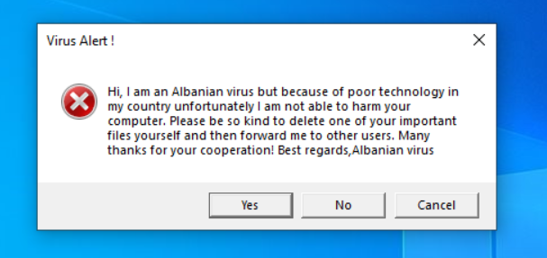

albanian virus
==============



A recreation of the [albanian virus meme][1] 

This version:

- is written in C (which means you can compile it to an exe, and send it to your friends to prank them)

- is very simple (it's just 11 lines of code with no dependencies)

- runs natively only on Windows (because it uses the win32 API to create the pop-up), but you can use Wine to run it on Linux/macOS/whatever

Compiling
---------

If you have [Zig][2] installed, you can just run this:

```sh
zig cc albanian-virus.c -target x86_64-windows-gnu -o virus.exe
```

Other C compilers should also work, but I didn't bother testing them since `zig cc` is the only one that can easily cross-compile (I don't use Windows)

[1]: https://www.reddit.com/r/masterhacker/comments/hbo7j2/the_virus_no_one_can_beat/
[2]: https://ziglang.org/
